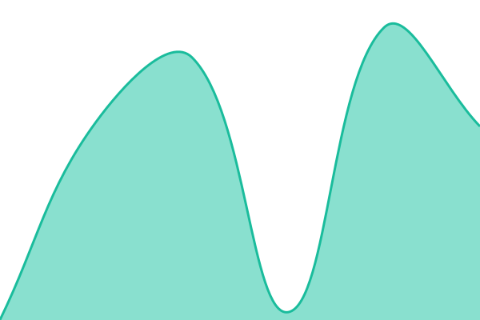

# [📈 Live Status](https://status.justenglish.lk): <!--live status--> **🟩 All systems operational**

This repository contains the open-source uptime monitor and status page for [teamjustenglish](https://status.justenglish.lk), powered by [Upptime](https://github.com/upptime/upptime).

With [Upptime](https://upptime.js.org), you can get your own unlimited and free uptime monitor and status page, powered entirely by a GitHub repository. We use [Issues](https://github.com/teamjustenglish/justenglish-status/issues) as incident reports, [Actions](https://github.com/teamjustenglish/justenglish-status/actions) as uptime monitors, and [Pages](https://status.justenglish.lk) for the status page.

<!--start: status pages-->
<!-- This summary is generated by Upptime (https://github.com/upptime/upptime) -->
<!-- Do not edit this manually, your changes will be overwritten -->
<!-- prettier-ignore -->
| URL | Status | History | Response Time | Uptime |
| --- | ------ | ------- | ------------- | ------ |
|  [JustEnglish Website](https://justenglish.lk) | 🟩 Up | [just-english-website.yml](https://github.com/teamjustenglish/justenglish-status/commits/HEAD/history/just-english-website.yml) | 

 10145ms
     
 | 

<a href="https://status.justenglish.lk/history/just-english-website">92.27%</a>
    

|  [Careers](https://careers.justenglish.lk) | 🟩 Up | [careers.yml](https://github.com/teamjustenglish/justenglish-status/commits/HEAD/history/careers.yml) | 

 1846ms
     
 | 

<a href="https://status.justenglish.lk/history/careers">100.00%</a>
    

|  [Reviews](https://reviews.justenglish.lk) | 🟩 Up | [reviews.yml](https://github.com/teamjustenglish/justenglish-status/commits/HEAD/history/reviews.yml) | 

 986ms
     
 | 

<a href="https://status.justenglish.lk/history/reviews">100.00%</a>
    

|  [Stories](https://stories.justenglish.lk) | 🟩 Up | [stories.yml](https://github.com/teamjustenglish/justenglish-status/commits/HEAD/history/stories.yml) | 

 1775ms
     
 | 

<a href="https://status.justenglish.lk/history/stories">100.00%</a>
    

|  [Mission Control (BatchTrack)](https://missioncontrol.justenglish.lk) | 🟩 Up | [mission-control-batch-track.yml](https://github.com/teamjustenglish/justenglish-status/commits/HEAD/history/mission-control-batch-track.yml) | 

 866ms
     
 | 

<a href="https://status.justenglish.lk/history/mission-control-batch-track">100.00%</a>
    

|  [Level Test](https://level.justenglish.lk) | 🟩 Up | [level-test.yml](https://github.com/teamjustenglish/justenglish-status/commits/HEAD/history/level-test.yml) | 

 698ms
     
 | 

<a href="https://status.justenglish.lk/history/level-test">100.00%</a>
    

|  [Cliff Program](https://cliff.justenglish.lk) | 🟩 Up | [cliff-program.yml](https://github.com/teamjustenglish/justenglish-status/commits/HEAD/history/cliff-program.yml) | 

 1976ms
     
 | 

<a href="https://status.justenglish.lk/history/cliff-program">100.00%</a>
    

|  [Payments](https://payments.justenglish.lk) | 🟩 Up | [payments.yml](https://github.com/teamjustenglish/justenglish-status/commits/HEAD/history/payments.yml) | 

 861ms
     
 | 

<a href="https://status.justenglish.lk/history/payments">100.00%</a>
    

|  [Careers Dashboard](https://careers.justenglish.lk/dash) | 🟩 Up | [careers-dashboard.yml](https://github.com/teamjustenglish/justenglish-status/commits/HEAD/history/careers-dashboard.yml) | 

 859ms
     
 | 

<a href="https://status.justenglish.lk/history/careers-dashboard">100.00%</a>
    

|  [Stories Dashboard](https://stories.justenglish.lk/dashboard) | 🟩 Up | [stories-dashboard.yml](https://github.com/teamjustenglish/justenglish-status/commits/HEAD/history/stories-dashboard.yml) | 

 828ms
     
 | 

<a href="https://status.justenglish.lk/history/stories-dashboard">100.00%</a>
    

|  [Payments - Upload](https://payments.justenglish.lk/upload) | 🟩 Up | [payments-upload.yml](https://github.com/teamjustenglish/justenglish-status/commits/HEAD/history/payments-upload.yml) | 

 149ms
     
 | 

<a href="https://status.justenglish.lk/history/payments-upload">100.00%</a>
    

|  [Payments - Dashboard](https://payments.justenglish.lk/dash) | 🟩 Up | [payments-dashboard.yml](https://github.com/teamjustenglish/justenglish-status/commits/HEAD/history/payments-dashboard.yml) | 

 289ms
     
 | 

<a href="https://status.justenglish.lk/history/payments-dashboard">100.00%</a>
    

<!--end: status pages-->

[**Visit our status website →**](https://status.justenglish.lk)

## 📄 License

- Powered by: [Upptime](https://github.com/upptime/upptime)
- Code: [MIT](./LICENSE) © [Anand Chowdhary](https://anandchowdhary.com)
- Data in the `./history` directory: [Open Database License](https://opendatacommons.org/licenses/odbl/1-0/)
